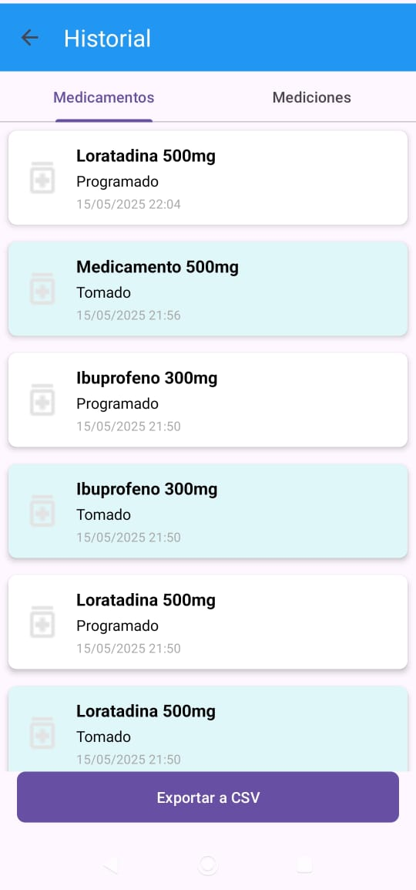
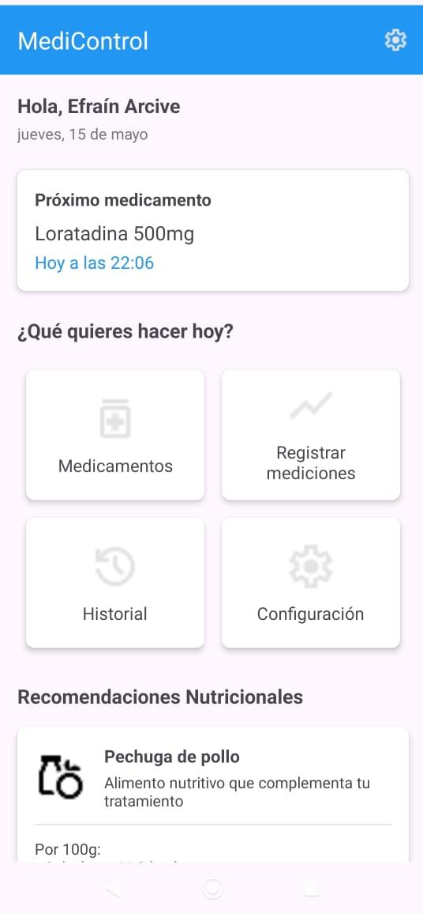
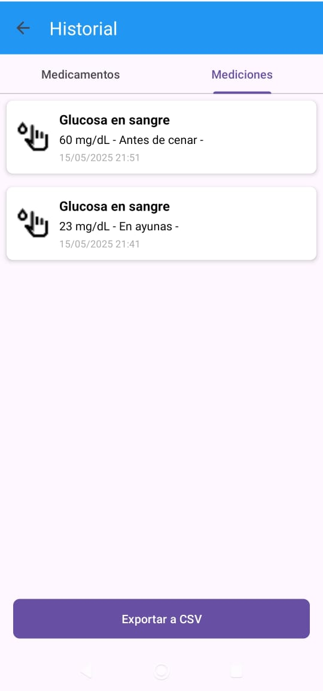
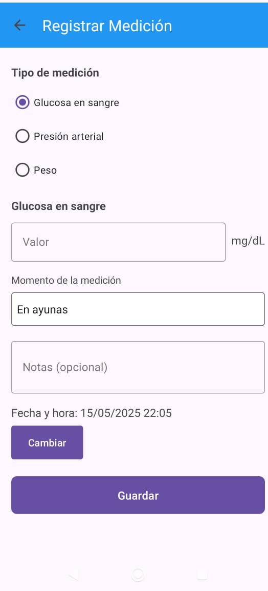

# MyMediControl

**MyMediControl** es una aplicación móvil para Android diseñada para ayudar a los usuarios a gestionar y hacer seguimiento de su salud personal, con un enfoque especial en el control de medicamentos y mediciones de signos vitales.

---

## 📋 Características Principales

### 🩺 Control de Medicamentos
- **Registro de dosis**: Permite a los usuarios registrar cuándo han tomado sus medicamentos.
- **Historial de medicación**: Visualización de todas las dosis con fechas y estados.

### 📊 Monitoreo de Signos Vitales
- **Múltiples parámetros**: Registra mediciones de:
  - Glucosa en sangre (mg/dL)
  - Presión arterial (mmHg)

### 📱 Interfaz Intuitiva
- **Sistema de pestañas**: Navegación sencilla entre historiales.
- **Visualización organizada**: Historial ordenado cronológicamente con la información más reciente primero.
- **Indicadores visuales**: Iconos y códigos de color para facilitar la interpretación.

### ➕ Funcionalidades Adicionales
- **Exportación de datos**: Capacidad para exportar el historial.
- **Notas personalizadas**: Permite agregar comentarios a las mediciones.
- **Interfaz adaptable**: Muestra mensajes apropiados cuando no hay datos disponibles.

---

## 📷 Capturas de Pantalla

---

## ⚙️ Requisitos

- Android 5.0 (Lollipop) o superior
- Permisos de almacenamiento (para la función de exportación)

---

## 🛠️ Instalación

1. Descarga el archivo .zip
2. Importa el projecto en Android Studio
3. Commpila
4. ¡Comienza a gestionar tu salud!

---

## 🧪 Tecnologías Utilizadas

- Kotlin  
- SQLite  
- RecyclerView  
- CardView  
- Material Design

---

## 🧱 Estructura del Proyecto

El proyecto sigue una arquitectura simple basada en actividades y adaptadores:

- `HistoryActivity`: Muestra el historial de medicamentos y mediciones
- `HistoryAdapter`: Se encarga de la representación visual de los elementos del historial
- `HistoryItem`: Modelo de datos para los elementos del historial
- `HistoryStatus`: Enumeración para los diferentes estados posibles

---

## 🔮 Roadmap

- [ ] Añadir notificaciones para recordatorios de medicación
- [ ] Implementar gráficos para visualizar tendencias en mediciones
- [ ] Sincronización con la nube
- [ ] Versión para iOS

---
